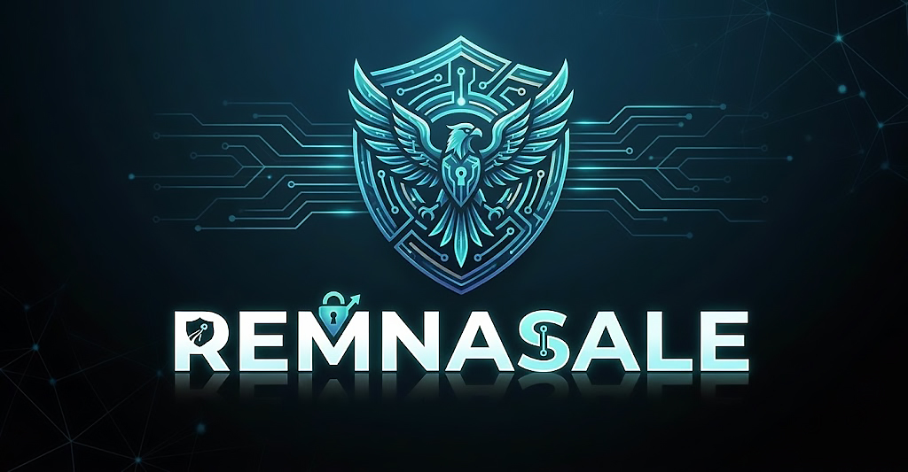

<p align="center">
  
</p>

<h1 align="center">Remnasale</h1>
<p align="center">
  <b>Telegram-бот для продажи VPN-подписок с интеграцией Remnawave Panel</b>
</p>

<p align="center">
  <a href="https://github.com/DanteFuaran/Remnasale/releases"></a>
  
  
</p>

---

## 🚀 Быстрый старт

### ▶️ Установка одной командой

```bash
cd /opt && bash <(curl -s https://raw.githubusercontent.com/DanteFuaran/Remnasale/main/remnasale-install.sh)
```

> После установки управление доступно через команду **`rs`** или **`remnasale`**

### 📝 Данные для настройки

| Параметр | Описание |
|----------|----------|
| **Домен бота** | Домен для webhook, например `bot.example.com` |
| **Токен бота** | Получите в [@BotFather](https://t.me/BotFather) |
| **Telegram ID владельца** | Числовой ID ([@userinfobot](https://t.me/userinfobot)) |
| **Username поддержки** | Никнейм группы/канала поддержки (без `@`) |
| **API токен Remnawave** | Токен из панели с правами администратора |

> ⚠️ Ключи шифрования, пароли БД и Redis генерируются автоматически.

### 📦 Что сделает скрипт

> ✅ Установит Docker и Docker Compose  
> ✅ Создаст структуру каталогов  
> ✅ Сгенерирует конфигурацию `.env`  
> ✅ Развернёт PostgreSQL и Redis  
> ✅ Запустит бота и применит миграции БД  
> ✅ Настроит webhook для Telegram  
> ✅ Установит панель управления `remnasale`  

---

## ✨ Возможности

<details>
<summary>💳 Платёжные системы</summary>

Бот поддерживает **9 способов оплаты**, задействовать можно несколько одновременно:

| Шлюз | Описание |
|------|----------|
| ⭐ **Telegram Stars** | Встроенная оплата через Telegram |
| 💳 **ЮKassa** | Банковские карты, СБП, электронные кошельки |
| 💳 **ЮMoney** | Электронный кошелёк ЮMoney |
| 💳 **Lava** | Российский платёжный шлюз |
| 💳 **Platega** | Российский платёжный шлюз |
| 💳 **Robokassa** | Многоканальный эквайринг |
| 🔐 **Cryptomus** | Криптовалютные платежи |
| 💎 **Heleket** | Международные криптоплатежи |
| 💰 **Cryptopay** | Криптовалютный эквайринг |

Помимо внешних шлюзов, поддерживается **внутренний баланс** — пополнение, переводы между пользователями, кешбек.

</details>

<details>
<summary>📦 Тарифные планы</summary>

Гибкая настройка любых тарифов прямо из бота без перезапуска:

- **4 типа ограничений:** трафик / устройства / трафик+устройства / безлимит
- **Неограниченное количество** периодов и ценовых предложений
- **Мультивалютность** — RUB, USD, EUR, XTR (Telegram Stars)
- **6 вариантов доступности:** для всех / новых / клиентов / приглашённых / разрешённых / пробника
- **Теги** — привязка плана к тегу в Remnawave для автосинхронизации
- **Сквады** — поддержка внутренних и внешних сквадов Remnawave
- **Глобальная скидка** — процентная или фиксированная на все тарифы

</details>

<details>
<summary>🎁 Пробный период</summary>

- Бесплатный пробный доступ без привязки карты
- Отдельный тариф для пробника
- Реферальная пробная подписка (по приглашению)
- Поддержка ограничения: только для новых пользователей

</details>

<details>
<summary>📱 Дополнительные устройства</summary>

- Продажа дополнительных слотов устройств
- **3 режима оплаты:** единоразово / ежемесячно / до конца подписки
- Настройка минимального срока и стоимости
- Автопродление с уведомлениями
- Удаление и управление через меню пользователя

</details>

<details>
<summary>🎟 Промокоды</summary>

- Скидки **процентные и фиксированные**
- Ограничение количества активаций и срок действия
- Привязка к конкретным пользователям или тарифам
- Генерация случайного кода
- Типы наград: скидка / бесплатная подписка / бонусный баланс / дополнительные дни

</details>

<details>
<summary>👥 Реферальная система</summary>

- **2 уровня рефералов**
- Тип награды: деньги или дополнительные дни
- Стратегия начисления: первый платёж / каждый платёж
- Форма начисления: фиксированная сумма или процент
- **Кешбек** с каждой оплаты рефереру
- Настраиваемое сообщение-приглашение с предпросмотром
- История рефералов и выплат

</details>

<details>
<summary>💰 Баланс и переводы</summary>

- Пополнение баланса через любые подключённые шлюзы
- Переводы между пользователями с настраиваемой комиссией
- **2 режима баланса:** раздельный (основной + бонусный) / объединённый
- Настройка минимальной и максимальной суммы перевода
- История переводов

</details>

<details>
<summary>🔔 Уведомления</summary>

**Пользовательские (автоматически):**

| Событие | Описание |
|---------|----------|
| ⏰ Подписка истекает | За 3, 2 и 1 день до истечения |
| ❌ Подписка истекла | В момент истечения и через 1 день |
| 🌐 Трафик исчерпан | При превышении лимита трафика |
| 🎁 Реферал прикреплён | При регистрации нового реферала |
| 💰 Получено вознаграждение | При начислении реферальной выплаты |

**Системные (администратору):**

Новые регистрации, покупки, активации промокодов, смена устройства (HWID), статус нод, финансовые операции, жизненный цикл бота, обновления.

</details>

<details>
<summary>📢 Рассылки</summary>

- Отправка по сегментам: **все / по плану / с подпиской / без подписки / просроченным / с пробником**
- Поддержка текста, фото, видео, документов
- Кнопки inline в рассылке
- Предпросмотр перед отправкой
- Статистика доставки и остановка рассылки в процессе

</details>

<details>
<summary>🔓 Режим доступа</summary>

| Режим | Описание |
|-------|----------|
| 🌍 **Публичный** | Регистрация и покупки разрешены для всех |
| ✉️ **По приглашению** | Только пользователи с реферальной ссылкой |
| 🔒 **Закрытый** | Все действия запрещены |

Независимое управление **регистрацией** и **покупками**.  
Дополнительные условия: обязательное принятие правил, обязательная подписка на канал.

</details>

<details>
<summary>🌍 Мультиязычность</summary>

| Язык | |
|------|-|
| 🇷🇺 Русский | ✅ |
| 🇺🇦 Українська | ✅ |
| 🇬🇧 English | ✅ |
| 🇩🇪 Deutsch | ✅ |

- Автоопределение языка пользователя Telegram
- Возможность зафиксировать единый язык для всех
- Расширяемость: добавьте папку в `assets/translations/` и укажите в `APP_LOCALES`

</details>

<details>
<summary>📡 Интеграция с Remnawave</summary>

- Синхронизация пользователей и подписок через webhook в реальном времени
- Создание, продление, смена тарифа напрямую в панели Remnawave
- Автообновление имени тарифа при изменении в панели
- Импорт пользователей из Remnawave Panel
- Мониторинг нод и статуса серверов
- Поддержка сквадов и инбаундов

</details>

<details>
<summary>👨‍💼 Dashboard (панель администратора)</summary>

#### 👥 Пользователи
- Поиск по ID, username, имени
- Просмотр и редактирование профиля
- Управление балансом (основным и бонусным)
- Назначение ролей (USER / ADMIN / DEV)
- Блокировка / разблокировка
- История покупок и список рефералов
- Прямое изменение подписки (тариф, трафик, устройства, дата истечения)
- Синхронизация с Remnawave

#### 📦 Тарифы
- Создание, редактирование, удаление тарифов
- Включение / выключение плана
- Статистика по каждому тарифу

#### 🎟 Промокоды
- Список, поиск, создание, редактирование, удаление

#### 💳 Платёжные системы
- Настройка каждого шлюза (API-ключи, комиссии, валюта по умолчанию)
- Тестирование шлюза
- Управление позиционированием в меню пользователя

#### 📊 Статистика
- 5 страниц: Remnawave, Пользователи, Транзакции, Платежи, Тарифы

#### 📋 Журнал
- Просмотр событий: транзакции, покупки, блокировки
- Экспорт журнала в файл

#### ⚙️ Функционал
- Включение/выключение модулей: баланс, переводы, доп.устройства, сообщество, соглашение

#### 🏷️ Глобальная скидка
- Процентная или фиксированная скидка на все тарифы
- Влияние: подписки / доп.устройства / комиссии переводов
- Режим применения: максимальная / сложенная

#### 💱 Курс валют
- Ручной или автоматический курс
- База: RUB / USD / EUR

#### 🔔 Уведомления
- Тонкая настройка каждого пользовательского и системного уведомления

#### 📥 Импорт
- Импорт пользователей из Remnawave Panel или X-UI 3

#### 🤖 Управление ботом
- Проверка обновлений и обновление одной кнопкой
- Перезапуск бота
- Зеркальные боты

</details>

<details>
<summary>🧰 Панель управления сервером (`rs`)</summary>

```bash
rs   # или: remnasale
```

| Действие | Описание |
|----------|----------|
| 🔄 Обновить | Проверка и установка обновлений с GitHub |
| ℹ️ Просмотр логов | Архивированные логи контейнеров |
| 📊 Логи в реальном времени | Live-вывод (Ctrl+C для выхода) |
| 🔃 Перезагрузить бота | Перезапуск Docker-контейнеров |
| 🔃 Перезагрузить с логами | Перезапуск + автовывод логов |
| ⬆️ Включить бота | Запуск остановленного бота |
| ⬇️ Выключить бота | Остановка всех контейнеров |
| 💾 База данных | Сохранение/загрузка БД, автобэкап в Telegram |
| 🔄 Переустановить | Полная переустановка с сохранением данных |
| ⚙️ Изменить настройки | Редактирование `.env` конфигурации |
| 🧹 Очистить данные | Сброс данных бота |
| 🗑️ Удалить бота | Полное удаление |

</details>

---

## 📋 Требования

| Компонент | Требования |
|-----------|------------|
| **ОС** | Ubuntu 22.04 / 24.04, Debian 11 / 12 |
| **RAM** | от 1 GB (рекомендуется 2 GB) |
| **Домен** | A-запись на IP сервера |
| **Порт** | 443 (HTTPS) — порт 80 открывается автоматически только при получении и обновлении сертификатов |
| **Remnawave** | Версия 2.5.24+, API токен администратора |
| **Telegram Bot** | Токен от @BotFather |

---

## 💰 Поддержать проект

Если проект оказался полезен, вы можете поддержать разработку:

| Метод | Реквизиты |
|-------|-----------|
| **USDT (TRC-20)** | `THqJQsgbWY7Tw1BxdLA6SQAkBGVmMhzeLZ` |
| **BTC (BEP-20)** | `0x657685922d7a9c50e3e90cae3ba9905985349fbb` |
| **ЮMoney** | `4100118836481809` |

❤️ Спасибо за вашу поддержку!

---

## 🔧 Решение проблем

<details>
<summary>Показать подробности</summary>

### Проверьте что:

> ✅ Домен правильно указывает на IP сервера через **A-запись**  
> ✅ **Токен бота** корректный и активный (проверьте в @BotFather)  
> ✅ **Payments Provider** подключён для Telegram Stars  
> ✅ **API токен Remnawave** имеет права администратора  
> ✅ **URL панели Remnawave** доступен с сервера бота  
> ✅ Порт **443** свободен и не занят другими службами  

### Как диагностировать:

> 📜 Проверьте логи: `rs` → `ℹ️ Просмотр логов`  
> 🔄 Перезапустите бота: `rs` → `🔃 Перезагрузить бота`  
> ⚙️ Проверьте `.env`: `rs` → `⚙️ Изменить настройки`  
> 🆘 Если не помогает — откройте **Issue** на GitHub с логами  

</details>

---

## ❤️ Благодарности

Бот создавался с упором на функциональность, безопасность и удобство использования.  
Спасибо всем, кто помогает тестировать и улучшать систему.

---

## 📜 Лицензия

Проприетарное ПО. Все права защищены.

---

<p align="center">
  <b>⭐ Поставьте звезду, если проект оказался полезным!</b>
</p>
